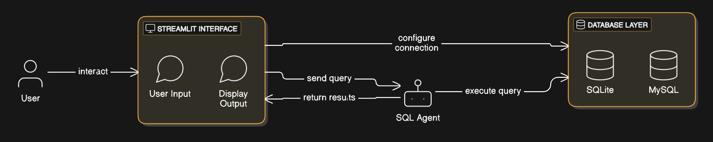

# SQL Chat Boat  


**SQL Chat Boat** is an interactive application that lets you query your databases (SQLite or MySQL) using natural language. Built with Streamlit, LangChain, and Groq LLM, it bridges the gap between human language and SQL, making database exploration intuitive and straightforward.

---

## Features  
- **Multi-Database Support**: Works seamlessly with SQLite and MySQL databases.  
- **Natural Language Querying**: Ask questions in plain English and get SQL-driven answers.  
- **Powerful AI Integration**: Uses Groq's Gemma2-9b-it model for advanced language understanding.  
- **Secure and Flexible**: Allows safe input of database credentials.  
- **User-Friendly Interface**: Designed for technical and non-technical users alike.  

---

## Prerequisites  
Before using the app, ensure the following:  
- Python 3.8 or later is installed.  
- SQLite3 is installed for local database use.  
- MySQL Server is set up if connecting to a MySQL database.  

---

## Set up the Environment  

### 1. Clone the Repository  
   ```bash
   git clone https://github.com/Chandrashekhar569/SQL-Chat-Boat.git
   cd sql_chat_boat
   ```  

### 2. Install Required Dependencies  
   - Install all necessary Python libraries:  
     ```bash
     pip install -r requirements.txt
     ```  

### 3. Configure API Keys  
   - Create a `.env` file in the root directory and add your API key(s):  
     ```env
     GROQ_API_KEY=your_groq_api_key
     # Uncomment below if using OpenAI
     # OPENAI_API_KEY=your_openai_api_key
     ```  

### 4. Run the Application  
   - Start the app with Streamlit:  
     ```bash
     streamlit run app.py
     ```  

### 5. Access the App  
   - Open your browser and navigate to the displayed Streamlit URL (e.g., `http://localhost:8501`).  

---

## Usage Instructions  

1. **Select Database**:  
   - Choose between **SQLite** and **MySQL** from the sidebar.  
   - For **SQLite**, ensure the `student.db` file is available in the project directory.  
   - For **MySQL**, provide the host, username, password, and database name.  

2. **Ask Questions**:  
   - Type your query in natural language (e.g., "List students with GPA > 3.5").  
   - The app converts it to SQL, executes it, and displays the result.  

3. **Clear Chat History**:  
   - Use the sidebar button to reset the conversation for a fresh start.  

---

## File Structure  

```plaintext
sql_chat_boat/
├── app.py             # Main application script
├── requirements.txt   # Python dependencies
├── student.db         # Sample SQLite database
├── .env               # API key configuration file
├── diagram.png        # Application architecture or flow diagram
└── README.md          # Project documentation
```  

---

## Contributing  

We welcome contributions to make **SQL Chat Boat** even better!  

### Steps to Contribute:  
1. Fork the repository.  
2. Create a feature branch:  
   ```bash
   git checkout -b feature-name
   ```  
3. Commit your changes:  
   ```bash
   git commit -m "Description of changes"
   ```  
4. Push to your branch:  
   ```bash
   git push origin feature-name
   ```  
5. Open a Pull Request.  

---

## Contact  

- **LinkedIn**: [Chandrashekhar Chaudhari](https://www.linkedin.com/in/chandrashekhar1997/)  
- **GitHub**: [Chandrashekhar569](https://github.com/Chandrashekhar569/SQL-Chat-Boat)  

---

## License  
This project is licensed under the MIT License. See the [LICENSE](LICENSE) file for details.  
